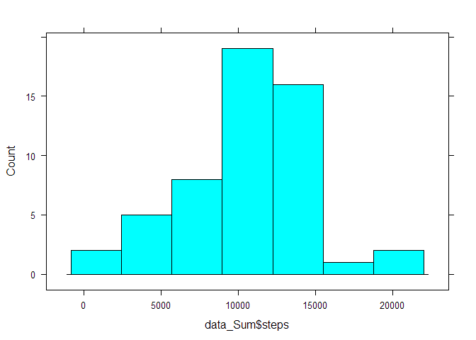
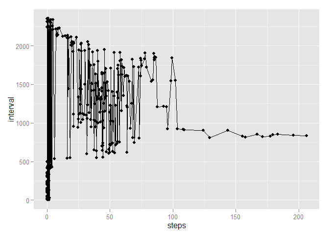
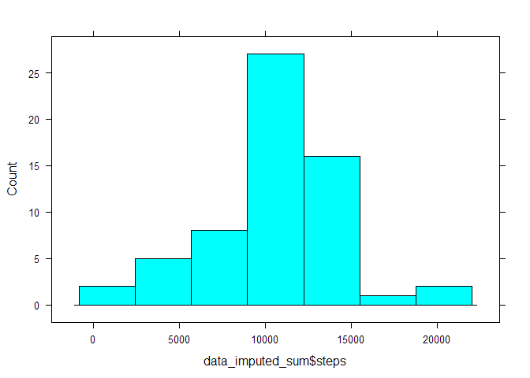
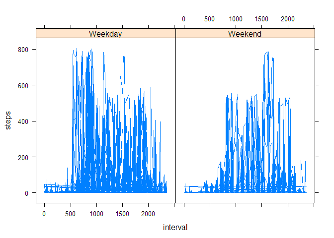

# Reproducible Research: Peer Assessment 1


## Loading and preprocessing the data


```r
## This assumes activity.csv is in your working dir
data <- read.csv("./activity.csv")
# Just wanna see what I'm working with is all
str(data)
```

```
## 'data.frame':	17568 obs. of  3 variables:
##  $ steps   : int  NA NA NA NA NA NA NA NA NA NA ...
##  $ date    : Factor w/ 61 levels "2012-10-01","2012-10-02",..: 1 1 1 1 1 1 1 1 1 1 ...
##  $ interval: int  0 5 10 15 20 25 30 35 40 45 ...
```

```r
# WTF date is set as a factor? No thx. Coercing
data$date <- as.Date(data$date,c("%Y-%m-%d"))
# adding on weekday variable
data$day <- weekdays(as.Date(data$date))
data$day <- factor(data$day)
# Adding data_Sum, which holds the total number of steps per day. Need that later.
data_Sum <- aggregate(steps ~ date, data = data, FUN = sum)
# Adding data_Sum2, holds mean number of steps per interval
data_Sum2 <- aggregate(steps ~ interval, data = data, FUN = mean)
```


## What is mean total number of steps taken per day?

```r
## Create histogram of the most poorly worded instructions on the planet. Seriously, I spent more time trying to figure out what the hell they wanted vs actually making the damn plot.
histogram(~ data_Sum$steps, type="count")
```

 

```r
## Ignoring NA's per instructions. Mean and Median number of steps per day.
summary(data_Sum$steps)
```

```
##    Min. 1st Qu.  Median    Mean 3rd Qu.    Max. 
##      41    8840   10800   10800   13300   21200
```


## What is the average daily activity pattern?


```r
# Create line plot of interval vs steps
ggplot(data=data_Sum2, aes(x=steps, y=interval )) + geom_line() + geom_point()
```

 
  
  
As we can see, the rightmost point on this graph has the highest amount of average stepcount per day. The most active interval would definitely be around the 800-850 interval mark.


## Imputing missing values
Calculating NA's in dataframe

```r
sum(is.na(data))
```

```
## [1] 2304
```

Try my hand at imputing with Hmisc impute()


```r
# Create imputed data frame
data_imputed <-  with(data, impute(steps, mean))
data_imputed <- data.frame(data_imputed)
data_imputed$date <-  with(data, impute(date, mean))
data_imputed$interval <-  with(data, impute(interval, mean))

# Name dem columns
colnames(data_imputed) <- c("steps","date","interval")
```
Now that the imputation process is done, we recalculate histograms and summary statistics

```r
data_imputed_sum <- aggregate(steps ~ date, data = data_imputed, FUN = sum)
## Create new histogram
histogram(~ data_imputed_sum$steps, type="count")
```

 

```r
## Recalculate summary stats
summary(data_imputed_sum)
```

```
##       date                steps      
##  Min.   :2012-10-01   Min.   :   41  
##  1st Qu.:2012-10-16   1st Qu.: 9819  
##  Median :2012-10-31   Median :10766  
##  Mean   :2012-10-31   Mean   :10766  
##  3rd Qu.:2012-11-15   3rd Qu.:12811  
##  Max.   :2012-11-30   Max.   :21194
```
As expected, by imputing the mean of each data set against all NA values, the results over the summary statistics were nigh negligible.

## Are there differences in activity patterns between weekdays and weekends?
Firstly, we play around with the imputed database, creating variables day and weekday.

```r
# Create $day detailing which weekday the date is
data_imputed$day <- weekdays(as.Date(data_imputed$date))
data_imputed$day <- factor(data_imputed$day)
# Create categorical weekday variable
data_imputed$weekday[data_imputed$day == "Monday" | data_imputed$day == "Tuesday" | data_imputed$day == "Wednesday" | data_imputed$day == "Thursday" | data_imputed$day == "Friday"] <- 1
data_imputed$weekday <- as.numeric(data_imputed$weekday)
data_imputed$weekday[is.na(data_imputed$weekday)] <- 2
data_imputed$weekday <- factor(data_imputed$weekday)
levels(data_imputed$weekday) <- c("Weekday","Weekend")
```

Now that this is done, we have have an imputed database detailing the mean of steps for every day, along with the associated interval and weekend/weekday status. We will now utilize the aggregate function to create a summary of steps taken and average them out over every day.  


```r
# Create data of means by day.
data_imputed_mean <- aggregate(steps ~ interval + date + day + weekday, data = data_imputed, FUN = mean)
head(data_imputed_mean)
```

```
##   interval       date    day weekday steps
## 1        0 2012-10-05 Friday Weekday     0
## 2        5 2012-10-05 Friday Weekday     0
## 3       10 2012-10-05 Friday Weekday     0
## 4       15 2012-10-05 Friday Weekday     0
## 5       20 2012-10-05 Friday Weekday     0
## 6       25 2012-10-05 Friday Weekday     0
```

Now we create a line graph of the corresponding data using lattice xyplot() function.  


```r
# Create line graph of data

 xyplot(data_imputed_mean$steps ~ data_imputed_mean$interval | data_imputed_mean$weekday, type = "l", xlab ="interval",ylab ="steps")
```

 

The graph seems to suggest there is a higher level of activity, based on average steps per interval, during the weekdays than on the weekends.
